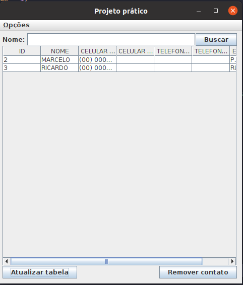
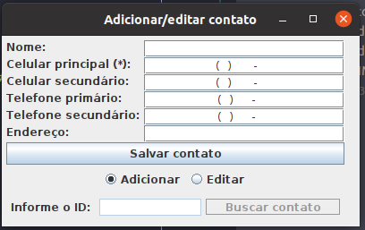

### Avaliação Prática - EXAPE (DSI)

**Instruções para realização da avaliação prática:**
O aluno deverá desenvolver um projeto prático completo, aplicando os conteúdos, ferramentas e tecnologias apresentadas e
adotadas na disciplina (ver documento DSIS4 – PPC). Para a entrega será utilizado um repositório público no GitHub, que 
deve ser preparado pelo aluno.

**O projeto será avaliado verificando o uso adequado das ferramentas e tecnologias: i) acesso a bancos de dados
relacionais na linguagem Java, ii) mapeamento OO-relacional, iii) arquitetura multicamadas e iv) interface gráfica.
Os itens serão analisados no contexto do projeto e de acordo com as práticas de uso.**

**Problema:** A empresa XYZ resolveu, a pedido de um cliente, desenvolver um projeto de software relacionado a agenda de
contatos pessoais. Este software deverá possuir funcionalidades básicas de manipulação dos contatos 
(_adicionar, pesquisar, remover e editar contatos_). Serão considerados relevantes as seguintes informações:
_nome, endereço, 2 telefones e 2 celulares_.

Como requisitos não funcionais para esse projeto:
- Aplicação desktop envolvendo interface gráfica;
- Armazenamento de informações em base de dados;
- O software deve possuir uma arquitetura multi camadas (por exemplo, MVC).

### Resolução

Para resolução do problema foi utilizado a arquitetura MVC, contendo as seguintes camadas:
- factory: contém a classe ConnectionFactory que é responsável por fazer a conexão com o banco de dados;
- model: contém classes responsáveis por realizar o carregamento das informações do banco de dados em objetos na memória 
da aplicação e vice-versa;
- dao: responsável pela persistência dos dados, contém as regras de interação com o banco;
- controller: realiza a interação direta com o **dao**, contendo os métodos de listagem, edição, remoção e adição;
- view: responsável pelas regras que envolvem a interface gráfica da aplicação;
- exception: responsável pelas exceções customizadas;
- helper: contém a classe **HelperView**, uma classe utilitária com métodos estáticos para trabalhar em conjunto com a 
view.

### Instruções

#### Banco de dados

Se você preferir, pode utilizar o docker para subir o banco de dados:

`docker container run -d -p 3106:3306 -e MYSQL_ROOT_PASSWORD=123mudar -e MYSQL_DATABASE=dsi_exape --name exape mariadb:10.5`

Após subir o banco, efetue a criação das tabelas:

`CREATE TABLE contacts (
  id INT(11) NOT NULL AUTO_INCREMENT,
  name VARCHAR(255) NOT NULL,
  primary_cellphone VARCHAR(20) NOT NULL,
  secondary_cellphone VARCHAR(20),
  primary_phone VARCHAR(20),
  secondary_phone VARCHAR(20),
  CONSTRAINT id_pk PRIMARY KEY (id)
);`

Caso não opte pelo docker, efetue a criação da database manualmente:

`CREATE DATABASE dsi_exape;`

#### Lib

Na raiz do projeto, dentro da pasta lib contém a biblioteca responsável pela conexão com o banco, está biblioteca
deve ser importada para que a conexão funcione.

#### Telas

##### Tela Principal
Na tela principal da aplicação podemos observar uma tabela que lista todos os contatos do banco de dados.

Para buscar um contato pelo nome, informe o nome e clique em **Buscar**.

O Botão de **Atualizar a tabela**, busca todos os contatos do banco.

Ao clicar em **Remover contato**, é mostrado um input na tela solicitando o id do contato que o usuário deseja remover.

##### Tela de Adicionar/Editar contato

Nesta tela é possível adicionar e editar um contato.

O campo **Celular principal( * )** é obrigatório e deve ser informado.

Após inserir os campos, clique em **Salvar contato** para salvar o contato no banco de dados.

Sempre que um contato for salvo, a tabela deve ser atualizada manualmente.

Quando a opção de edição é selecionada, todos os campos são desativos e o campo de ID é ativado. Para prosseguir com a 
edição, informe o ID, clique em **Buscar contato** e se o ID for válido os campos serão habilitados novamente e serão 
preenchidos com os dados do usuário que deseja editar.

